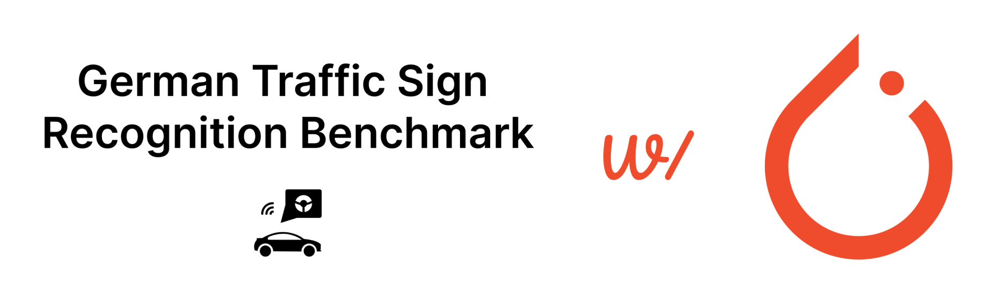

#  

## **GTRSB: Building a traffic sign recognition CNN using PyTorch**

This project aims to train a PyTorch model to detect and identify traffic signs.

The images used come from the GTRSB (German Traffic Sign Recognition Benchmark) dataset, available on TorchVision.

The project was carried out in five steps:

* 1: Data exploration, creation of a simple baseline model (see: ***1_baseline.ipynb***)
* 2: Creation of a more complex CNN, improving on the baseline (see: ***2_improving_CNN.ipynb***)
* 3: Verifying the performances with cross validation (see: ***3_cross_validation.ipynb***)
* 4: Comparing our CNN with a pretrained EfficientNet (see: ***4_transfer_learning.ipynb***)
* 5: Implementing early stopping (see: ***5_early_stopping.ipynb***)

## Results

|  Model | Accuracy (%)  | Macro F1-score (%)| Number of training epochs|Training time per epoch (s)
|---|---|---|---|---|
|Baseline| 84|77|10 |17|
|Best CNN|94|92|10|30|
|**EfficientNet V2_small**|**99**|**98**|**10**|**120**|
|EfficientNet V2_small early_stopping|97|95|2|120|

## General conclusions

In these notebooks, we obtained up to 99% accuracy and 98% macro F1-score on the task of traffic signs recognition.

Here are some ways to take this project further:

* Use the coordinates features available in the dataset to train a segmentation model
* Apply segmentation to videos

### *Dataset Credits :*

*J. Stallkamp, M. Schlipsing, J. Salmen, and C. Igel. The German Traffic Sign Recognition Benchmark: A multi-class classification competition.*
*In Proceedings of the IEEE International Joint Conference on Neural Networks, pages 1453–1460. 2011.*

*@inproceedings{Stallkamp-IJCNN-2011,*
    *author = {Johannes Stallkamp and Marc Schlipsing and Jan Salmen and Christian Igel},*
    *booktitle = {IEEE International Joint Conference on Neural Networks},*
    *title = {The {G}erman {T}raffic {S}ign {R}ecognition {B}enchmark: A multi-class classification competition},*
    *year = {2011},*
    *pages = {1453--1460}*
*}*
